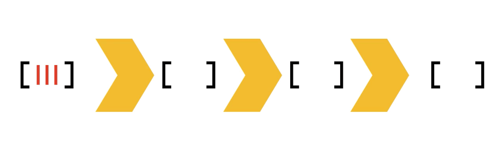
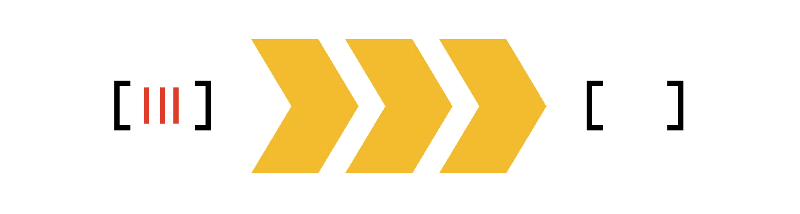
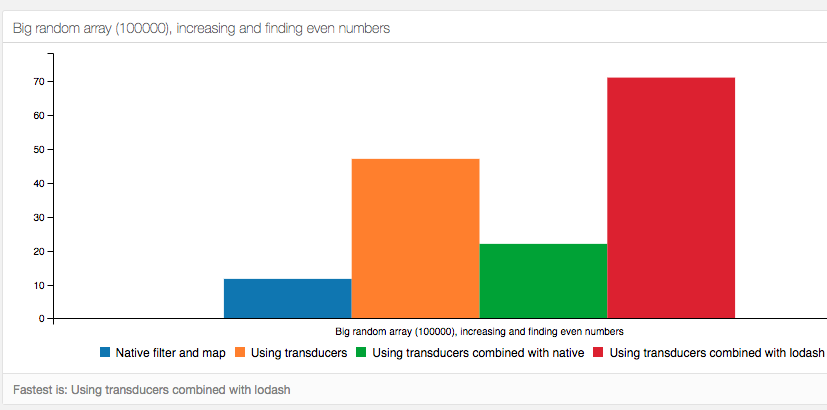

Some people told me at the retreat that they value my efforts at introducing new concepts. 
Hope they were sincere because here comes another round!
Today I want to talk you about transducers. Wait, what's the TLDR? I'm a busy person.
Let my first put the **SUPER-TLDR:**

### **transducers are reducers with super powers**

Now that I may have your interest, let me make a more technical **TLDR**:

### **transducers are composable high order reducers**

If you decide to go beyond this point, please make sure you read the entire thing because I'm going to start with some simplifications.
This means that at some point you may think: 
> I had enough of this useless non-sense

but you will be just at the middle of the mental click!

Ok, first things first, let's describe the problem transducers pretend to solve (which I will do with some indirection).
When map and filter were introduced to the spec they were a game changer. Code become much more shorter, simpler, easier to read and more declarative, an absolute win.
But when it was time to perform complex operations on collections (AKA arrays) they tend to be chained. For some people filter + map become a second nature, and it is not hard to find
pieces of code like this:

```js
const names = users
            .filter(active)
            .map(getName);
```

While that code is perfectly fine, it has a mayor problem: it iterates the array twice. And it not only iterates the array twice, it creates two intermediate arrays, but you only need one.
This may not be a problem on arrays of small size, or for some few operations like the one above, but it is not common to see people go crazy about chaining maps and filters...

```js
const avgAge = users
            .filter(active)
            .map(getAge)
            .map(Number)
            .reduce(average)
```

And that is just a very simple example, where you are iterating the entire array 4 times, creating 3 intermediate arrays just to produce a single integer.
If we have to put this on images, here is a good representation I borrowed from a medium article:

<!-- array chain image -->



Some solutions to this could be to compose the map functions together (because functor laws taught us that ` f(a) -> f(b) == f(a • b) `) but you still have to filter before and reduce after.
Transducers on the other hand, allow you to do all this (and more) in one single array iteration and without ANY intermediary array representation. 
Again, to give you a visual representation of this here is another animated image borrowed from the same article 

<!-- transducers image -->


At this point you may be convinced that transducers could be a good thing, but nothing you can't do without a reducer and some custom code inside, uh? 
Well, while this is true you are overlooking one of the main advantages of transducers than your custom reducer does not have: **composability**.
Transducers compose, custom code specific for one particular use-case don't. This not only has the advantage of better code reuse, it also makes code more understandable and more semantic.
What do you prefer, to read a bunch of code or just to read a pipe of statements telling what each step is doing? Don't even try to answer, it was a rhetoric question... 😝

Enough chattery, show me the code! 
Ok, lets start with the first concept, high order reducers: This mean that a transducer is a function that takes a reducer and returns another reducer.
Something like this

```js
const transducer = reducer => (acc,item) => { /*do your stuff here */}
```

All of you probably know that `reduce` is a more powerful method than `filter` and `map`, because those can both be expressed in terms of reduce.
Knowing that, let's try something more useful, let's make a reducer that filters out things.

```js
const filter = predicate => (acc,item) => 
    predicate(item) ? acc.concat([item]) : acc

const isOdd = x => x%2 === 0

[1,2,3,4].reduce(filter(isOdd),[]) //=> [2,4]
```

That's good! Let's do the same for map

```js
const mapper = transform => (acc,item) => acc.concat([transform(item)])

const double = x => x*2

[1,2,3,4].reduce(mapper(double),[]) //=> [2, 4, 6, 8]
```

I know what you are thinking... you promised us composability and those things does not compose! And you are right! 
The reason why they don't compose is because we are making too much assumptions. For example, our reducer functions assumes that you want an array as output.
In other words, they assume that they know how to combine the result, and that is what makes them so unflexible. 
Probably you may also noticed that the functions that I just showed do not strictly adhere to the definition of transducer, and again, you are right!
Let's remove that assumption and let's make them real transducers.

```js
// Just accept a combining function to abstract how we merge results...
const mapper = transformFn => combine => 
    (acc, item) => combine(acc, transformFn(item, acc));
  
const filter = predicate => combine => (acc, item) => 
    predicate(item, acc) ? combine(acc, item) : acc;

// Two different ways of combining results, for array and for numbers
const concat = (array, value) => array.concat([value]);
const sum = (x, y) => x+y;
```

With just that small change we made them way more powerful and reusable!
By the way, is the signature of the **combine** function familiar? Exactly! it is a reducer! We now have fulfilled our definition!
Please note that our mapper and filter functions are not transducers themselves but they are returning transducers. Now let's see them in action

```js
[1,2,3,4].reduce( filter(isOdd)(concat), []);//-> [2,4]
[1,2,3,4].reduce( filter(isOdd)(sum), 0); // -> 6
[1,2,3,4].reduce( mapper(double)(sum),0) //=> 20
[1,2,3,4].reduce( mapper(double)(concat),[]) //=> [2, 4, 6, 8]
```

That was very nice! we made a big improvement with such small change.
Have you noticed that? We also made them composable, already!

```js
// Let's pretend we have a compose function
const transduce = compose(mapper(double),filter(isOdd))

[1,2,3,4].reduce(transduce(sum),0) // => 20
[1,2,3,4].reduce(transduce(concat),[]) // => [2, 4, 6, 8]
```

If that didn't clicked yet let me explain it a bit. Remember: **transducer takes reducers and return reducers**, right?
We have a pipeline of transducers expecting a reducer and returning a reducer to the next function, which... guess what? return a reducer!
Step by step now: 
- When we pass the `sum` reducer it is taken by `filter-transducer`
- `filter-transducer` returns a reducer which is piped to the `mapper-transducer` function
- `mapper-transducer` takes that reducer and returns another reducer 
- the reduce method gets the final reducer!

Because each function it's passing the values directly to the next one we don't have any intermediate representations and we can filter and mutate in one single operation!

Let me showcase another example

```js
const users = [
  { "age": 9.149925344127997, "name": "Danielo", "active": true },
  { "age": 70.0940983547757, "name": "Durga", "active": true },
  { "age": 12.829762919306976, "name": "Oliver", "active": true },
  { "age": 11.413697124350097, "name": "Guro", "active": false },
  { "age": 44.0459554402999, "name": "Jay", "active": false },
  { "age": 21.15829418537192, "name": "Fahan", "active": false }
]

let activeUser = ({active}) => active
let getAge = ({age}) => age
let getName = ({name}) => name

// get all names of active users
let activeNames = compose( filter(activeUser), mapper(getName) )
users.reduce(activeNames(concat),[]) //=> ["Danielo", "Durga", "Oliver"]

// Get sum of the age of active users
let activeAges = compose( filter(activeUser), mapper(getAge) )
users.reduce(activeAges(sum),0) // => 92.07378661821066

// Get sum of the age of active users without decimals
let activeAgesInt = compose( 
    filter(activeUser), 
    mapper(getAge), 
    mapper(Math.round) 
);
users.reduce(activeAgesInt(sum),0) // => 92
```

Can you see it? We are able to perform any arbitrary number of operations in just one iteration without compromising readability or maintainability.

Now the only answer that's left is... does this increase performance? And that is actually a very good question!
If you use it for collections that are less than a couple of hundreds, then no, unless you have a very big transformation pipeline.
But as soon as the size of the arrays and the complexity of transformations starts to grow, the performance improvement is huge.
I'm not a person that makes such claims without proofs, so here are some graphics of some of my own benchmarks:

<!-- node benchmark -->



You can [check the graphs in more detail here](https://danielorodriguez.com/nodejs-benchmarks/)

If you want a transducers library focused on being as performant as possible, [here is one](https://github.com/cognitect-labs/transducers-js)

Here is a good collection of links if you want to dig more onto this topic
- https://medium.com/@roman01la/understanding-transducers-in-javascript-3500d3bd9624
- https://medium.com/javascript-scene/transducers-efficient-data-processing-pipelines-in-javascript-7985330fe73d
- https://medium.com/@dtipson/everything-reduced-transducers-in-javascript-8ea3459bc7f9
